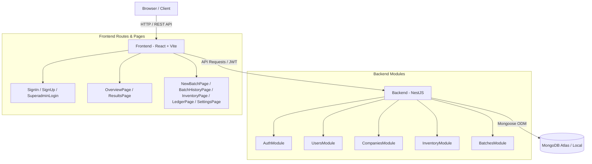
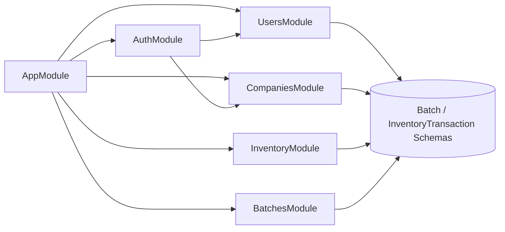
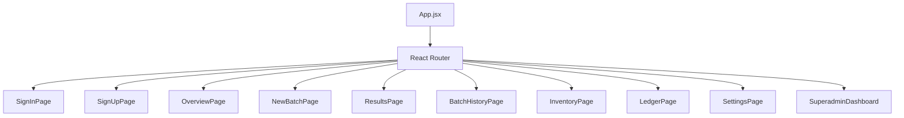

# RebarOptima Codebase Knowledge Graph (Graphify Report)

Generated: 2026-08-01

## 1. Project Overview & Architecture Map

RebarOptima is a monorepo containing a **NestJS (MongoDB/Mongoose)** backend and a **Vite / React** frontend.

---

## 2. Backend Module Dependency Graph

---

## 3. Data Schemas & Relationships

| Entity Schema | Collection | Key Fields | Associated Modules |
| :--- | :--- | :--- | :--- |
| **User** | `users` | `email`, `passwordHash`, `role`, `companyId` | `UsersModule`, `AuthModule` |
| **Company** | `companies` | `name`, `licenseKey`, `status`, `createdAt` | `CompaniesModule` |
| **StockItem** | `stockitems` | `companyId`, `grade`, `diameter`, `length`, `quantity` | `InventoryModule` |
| **ScrapRule** | `scraprules` | `companyId`, `minScrapLength`, `maxScrapLength` | `InventoryModule` |
| **Batch** | `batches` | `companyId`, `batchCode`, `orders`, `cuttingPlan`, `scrapGenerated` | `BatchesModule` |
| **InventoryTransaction** | `inventorytransactions` | `companyId`, `type`, `itemId`, `quantity` | `InventoryModule`, `BatchesModule` |

---

## 4. Frontend Component & Page Map

---

## 5. Hub Nodes ("God Nodes")

1. **`backend/src/app.module.ts`**: Central root module connecting Mongoose, Auth, Users, Companies, Inventory, and Batches modules.
2. **`backend/src/main.ts`**: Entry point configuring CORS, NestJS bootstrap, and global filters/pipes.
3. **`frontend/src/App.jsx`**: Root routing table managing app state, layout wrappers, and navigation paths.
