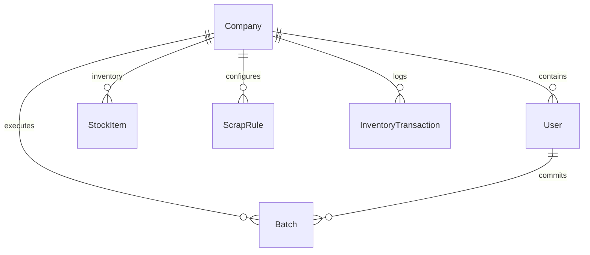

# RebarOptima Project Overview

This document is designed for AI models and developers to immediately understand the structure, architecture, domain model, and current development state of the **RebarOptima** application.

---

## 1. Project Purpose & Core Domain
**RebarOptima** is a web-based optimization tool designed to solve the **One-Dimensional Cutting Stock Problem (1D-CSP)** for rebars, steel sections, pipes, and other linear construction materials.
- **Goal**: Minimize steel waste (scrap) by calculating the most efficient way to cut desired part lengths from available stock lengths.
- **Core Heuristic**: Uses the First Fit Decreasing (FFD) algorithm.
- **Key Features**: Available stock entry, required parts entry (with label, length, quantity, diameter), kerf/trim margin configurations, visual cutting layout graphs, Excel/CSV reports export, and PDF generation.

---

## 2. Codebase Architecture

The project is structured as a monorepo containing a frontend and a backend application:

```
RebarOptima/
├── backend/            # NestJS Application & Mongoose MongoDB schemas
├── frontend/           # React, Vite, & Vanilla CSS SPA (performs client-side optimization)
└── package.json        # Workspace-level package config (Vercel analytics)
```

### A. Frontend (React + Vite)
- **State & Layout**: [App.jsx](file:///c:/Users/ketan/.gemini/antigravity-ide/scratch/RebarOptima/frontend/src/App.jsx) is the entry layout. It switches between the input workspace, overview/dashboard, history, results screen, and inventory ledger. It also renders advertising banners linking to Cravora Solutions.
- **Input Page**: [NewBatchPage.jsx](file:///c:/Users/ketan/.gemini/antigravity-ide/scratch/RebarOptima/frontend/src/pages/NewBatchPage/NewBatchPage.jsx) allows users to enter stock and parts in tables, import CSV data, and trigger optimization.
- **Results Page**: [ResultsPage.jsx](file:///c:/Users/ketan/.gemini/antigravity-ide/scratch/RebarOptima/frontend/src/pages/ResultsPage/ResultsPage.jsx) visualizes cutting layouts (using custom CSS bar segments), aggregates summary metrics, handles printing/PDF generation (via `html2pdf.js`), and handles CSV/Excel exports.
- **Core Optimizer Algorithm**: [optimizer.js](file:///c:/Users/ketan/.gemini/antigravity-ide/scratch/RebarOptima/frontend/src/utils/optimizer.js) implements the 1D-CSP solver.
  - Sorting: Parts are sorted in descending order of length.
  - Allocation: Employs First Fit Decreasing (FFD) to assign parts to stock bars.
  - Virtual Stocks: If parts exceed available stock, the algorithm generates a "virtual" stock bar of 12,000 mm (flagged as unavailable / needs purchase) so the user gets a complete cutting plan even with insufficient inventory.

### B. Backend (NestJS + Mongoose + MongoDB)
- **Database Connection**: Configured in [app.module.ts](file:///c:/Users/ketan/.gemini/antigravity-ide/scratch/RebarOptima/backend/src/app.module.ts) using `MongooseModule` pointing to `DATABASE_URL`.
- **Application Modules**: Located in [backend/src/](file:///c:/Users/ketan/.gemini/antigravity-ide/scratch/RebarOptima/backend/src). The following modules contain operational business logic, controllers, and services:
  - `auth`: JWT user login and register flows.
  - `companies`: Manages company profiles (multi-tenant isolation).
  - `users`: Standard user profiles and role management.
  - `inventory`: Tracks stock items, remnants, scrap rules, and logs inventory transaction history.
  - `batches`: Commits computed layouts to history, deducts consumed stock, saves reusable remnants to inventory, and tracks daily scrap graphs.

---

## 3. Database Entity Schema Summary

The backend models are defined using Mongoose schemas:



- **Company**: Represents the tenant. All organizational data is isolated by `companyId`.
- **User**: Member of a Company. Has a role (`SUPPORT`, `OWNER`, `ADMIN`, `ENGINEER`, `OPERATOR`, `VIEWER`).
- **StockItem**: Represents physical inventory lengths and quantities, distinguishing standard bars from remnants (`isRemnant: true`).
- **ScrapRule**: Dictates at what threshold (e.g. length in mm) a remnant bar becomes reusable stock instead of scrap.
- **InventoryTransaction**: Log of inventory modifications (`INWARD`, `OUTWARD`, `REMNANT`).
- **Batch**: Stores details of committed cutting layouts (input stock, required parts, layouts, summary stats, scrap & remnant weight in kg).

---

## 4. Key Files to Know

1. **Client-Side Optimization Engine**:
   - [optimizer.js](file:///c:/Users/ketan/.gemini/antigravity-ide/scratch/RebarOptima/frontend/src/utils/optimizer.js) - Contains `solve1DCSP` which receives stocks and parts, applies the FFD heuristic, and computes waste and utilization.
2. **Main Pages & Views**:
   - [NewBatchPage.jsx](file:///c:/Users/ketan/.gemini/antigravity-ide/scratch/RebarOptima/frontend/src/pages/NewBatchPage/NewBatchPage.jsx) - Front-end UI form handling available stock and requested parts.
   - [ResultsPage.jsx](file:///c:/Users/ketan/.gemini/antigravity-ide/scratch/RebarOptima/frontend/src/pages/ResultsPage/ResultsPage.jsx) - Renders the calculated patterns, handles file export (Excel CSV / PDF / Print).
3. **Backend Logic & Mongoose Models**:
   - [batch.schema.ts](file:///c:/Users/ketan/.gemini/antigravity-ide/scratch/RebarOptima/backend/src/batches/batch.schema.ts) - Schema representing historical batches.
   - [stock-item.schema.ts](file:///c:/Users/ketan/.gemini/antigravity-ide/scratch/RebarOptima/backend/src/inventory/stock-item.schema.ts) - Schema representing stock bars.
   - [batches.service.ts](file:///c:/Users/ketan/.gemini/antigravity-ide/scratch/RebarOptima/backend/src/batches/batches.service.ts) - Orchestrates batch commits, stock deduction, and remnant generation.

---

## 5. Current Implementation Status

| Component | Status | Details |
| :--- | :--- | :--- |
| **Frontend UI** | **Operational** | Built with React and custom Vanilla CSS. Fully handles input sheets, CSV imports, dashboard stats, batch history, inventory screens, and results viewing. |
| **Optimization Engine** | **Operational** | Runs fully client-side inside the browser using FFD heuristic. Supports kerf, trim margins, virtual stock items, and remnants-first prioritization. |
| **Backend REST API** | **Operational** | Fully written NestJS application. Features operational routes for batch submission, inventory management, user registration/session management, and ledger transactions. |
| **Database Schema** | **Operational** | Fully structured Mongoose MongoDB database. Integrated into the backend services and controllers. |
