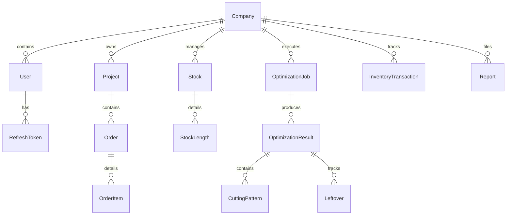

# RebarOptima Project Overview

This document is designed for AI models and developers to immediately understand the structure, architecture, domain model, and current development state of the **RebarOptima** application.

---

## 1. Project Purpose & Core Domain
**RebarOptima** is a web-based optimization tool designed to solve the **One-Dimensional Cutting Stock Problem (1D-CSP)** for rebars, steel sections, pipes, and other linear construction materials.
- **Goal**: Minimize steel waste (scrap) by calculating the most efficient way to cut desired part lengths from available stock lengths.
- **Core Heuristic**: Uses the First Fit Decreasing (FFD) algorithm.
- **Key Features**: Available stock entry, required parts entry (with label, length, quantity, diameter), kerf/trim margin configurations, visual cutting layout graphs, Excel/CSV reports export, and PDF generation.

---

## 2. Codebase Architecture

The project is structured as a monorepo containing a frontend and a backend application:

```
RebarOptima/
├── backend/            # NestJS Application & Prisma Database Schema
├── frontend/           # React, Vite, & Vanilla CSS SPA (performs client-side optimization)
└── package.json        # Workspace-level package config (Vercel analytics)
```

### A. Frontend (React + Vite)
- **State & Layout**: [App.jsx](file:///c:/Users/ketan/.gemini/antigravity-ide/scratch/RebarOptima/frontend/src/App.jsx) is the entry layout. It switches between the input workspace and results screen. It also renders advertising banners linking to Cravora Solutions.
- **Input Page**: [NewBatchPage.jsx](file:///c:/Users/ketan/.gemini/antigravity-ide/scratch/RebarOptima/frontend/src/components/NewBatchPage.jsx) allows users to enter stock and parts in tables, import CSV data, and trigger optimization.
- **Results Page**: [ResultsPage.jsx](file:///c:/Users/ketan/.gemini/antigravity-ide/scratch/RebarOptima/frontend/src/components/ResultsPage.jsx) visualizes cutting layouts (using custom CSS bar segments), aggregates summary metrics, handles printing/PDF generation (via `html2pdf.js`), and handles CSV/Excel exports.
- **Core Optimizer Algorithm**: [optimizer.js](file:///c:/Users/ketan/.gemini/antigravity-ide/scratch/RebarOptima/frontend/src/utils/optimizer.js) implements the 1D-CSP solver.
  - Sorting: Parts are sorted in descending order of length.
  - Allocation: Employs First Fit Decreasing (FFD) to assign parts to stock bars.
  - Virtual Stocks: If parts exceed available stock, the algorithm generates a "virtual" stock bar of 12,000 mm (flagged as unavailable / needs purchase) so the user gets a complete cutting plan even with insufficient inventory.

### B. Backend (NestJS + Prisma + PostgreSQL)
- **Database Schema**: [schema.prisma](file:///c:/Users/ketan/.gemini/antigravity-ide/scratch/RebarOptima/backend/prisma/schema.prisma) defines a multi-tenant PostgreSQL structure.
  - Key Enums: `Role`, `TransactionType`, `JobStatus`.
  - Core Models: `Company`, `User`, `RefreshToken`, `Project`, `Stock`, `StockLength`, `Order`, `OrderItem`, `OptimizationJob`, `OptimizationResult`, `CuttingPattern`, `Leftover`, `InventoryTransaction`, `Report`, `AuditLog`, `Notification`.
- **Application Modules**: Located in [backend/src/modules/](file:///c:/Users/ketan/.gemini/antigravity-ide/scratch/RebarOptima/backend/src/modules). Currently, they contain only empty boilerplate modules wired into [app.module.ts](file:///c:/Users/ketan/.gemini/antigravity-ide/scratch/RebarOptima/backend/src/app.module.ts):
  - `audit`
  - `auth`
  - `companies`
  - `inventory`
  - `notifications`
  - `optimizer`
  - `projects`
  - `reports`
  - `settings`
  - `shared`
  - `stock`
  - `users`

---

## 3. Database Entity Schema Summary

From [schema.prisma](file:///c:/Users/ketan/.gemini/antigravity-ide/scratch/RebarOptima/backend/prisma/schema.prisma):



- **Company**: Represents the tenant. All organizational data is isolated by `companyId`.
- **User**: Member of a Company. Has a role (`SUPPORT`, `OWNER`, `ADMIN`, `ENGINEER`, `OPERATOR`, `VIEWER`).
- **Stock & StockLength**: Represents physical inventory lengths and quantities.
- **Project & Order & OrderItem**: Represents orders specifying the parts (length, diameter, quantity, label) required.
- **OptimizationJob & OptimizationResult**: Stores execution state of cutting lists (`JobStatus`: `PENDING`, `RUNNING`, `COMPLETED`, `FAILED`) and computed output summaries.
- **CuttingPattern**: Specific cutting layout configurations (array of cuts, weight, waste length).
- **Leftover**: Reusable remnant bars cataloged for future stock.

---

## 4. Key Files to Know

1. **Client-Side Optimization Engine**:
   - [optimizer.js](file:///c:/Users/ketan/.gemini/antigravity-ide/scratch/RebarOptima/frontend/src/utils/optimizer.js) - Contains `solve1DCSP` which receives stocks and parts, applies the FFD heuristic, and computes waste and utilization.
2. **Main Pages & Views**:
   - [NewBatchPage.jsx](file:///c:/Users/ketan/.gemini/antigravity-ide/scratch/RebarOptima/frontend/src/components/NewBatchPage.jsx) - Front-end UI form handling available stock and requested parts.
   - [ResultsPage.jsx](file:///c:/Users/ketan/.gemini/antigravity-ide/scratch/RebarOptima/frontend/src/components/ResultsPage.jsx) - Renders the calculated patterns, handles file export (Excel CSV / PDF / Print).
3. **Configuration & Data Model**:
   - [schema.prisma](file:///c:/Users/ketan/.gemini/antigravity-ide/scratch/RebarOptima/backend/prisma/schema.prisma) - Source of truth for database structure.
   - [app.module.ts](file:///c:/Users/ketan/.gemini/antigravity-ide/scratch/RebarOptima/backend/src/app.module.ts) - Imports the skeleton NestJS modules.

---

## 5. Current Implementation Status

| Component | Status | Details |
| :--- | :--- | :--- |
| **Frontend UI** | **Operational** | Built with React and Vanilla CSS. Fully handles inputs, CSV data importing, and results viewing. Includes Cravora Solutions ads. |
| **Optimization Engine** | **Operational** | Runs fully client-side inside the browser using FFD heuristic. Understood to support kerf, trim margins, and virtual stock items. |
| **Backend REST API** | **Skeleton** | Boilerplate NestJS app structure setup with blank sub-modules. No operational business logic, controllers, or database connectivity routines. |
| **Database Schema** | **Defined** | Relational Postgres schema is fully defined in Prisma. Not yet connected to backend controllers or active business logic. |
